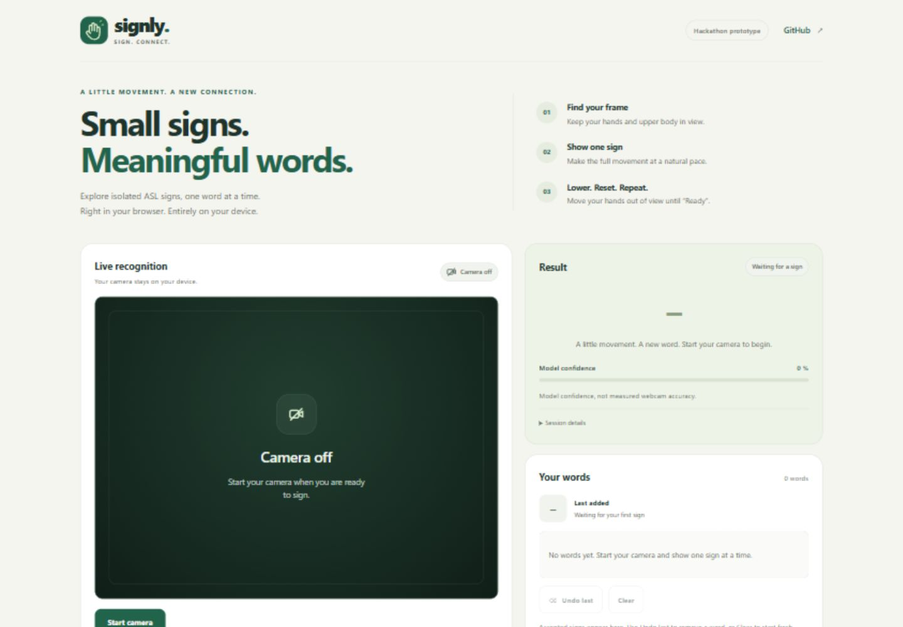
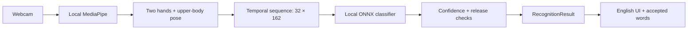

<p align="center">
  
</p>
<h1 align="center">Signly</h1>
<p align="center"><strong>Small signs. Meaningful words.</strong></p>
<p align="center">Isolated ASL word recognition — right in your browser, entirely on your device.</p>
<p align="center"><a href="#quick-start">Quick start</a> · <a href="#vocabulary">Vocabulary</a> · <a href="#how-it-works">Architecture</a> · <a href="#honest-limits">Known limits</a></p>



**A hackathon research prototype for 12 isolated ASL signs.** Signly turns a short webcam gesture into a word using two-hand and upper-body landmarks and a compact temporal model. Camera frames stay on your device. No account, API key, cloud inference or personal training recordings are needed.

This is a small-vocabulary experiment, **not continuous sign-language translation** or a replacement for an interpreter. The screenshot shows the real interface before the camera starts; it contains no simulated recognition result.

## What you can do

- Recognize a small set of isolated signs with a local ONNX model trained on public WLASL videos.
- See hand landmarks, capture guidance, confidence and specific retry explanations.
- Collect accepted words, undo the last word or clear the output. “Thank you” stays one item.
- Pause, resume and stop recognition with explicit controls.
- Use an English interface that adapts to desktop and mobile widths, supports keyboard focus and respects reduced-motion preferences.

## Quick start

Requires **Node.js 24** and npm. From the repository root, on Windows:

```powershell
cd app
npm.cmd ci
npm.cmd run assets
npm.cmd run dev
```

On macOS/Linux, use `npm` in place of `npm.cmd`. Open the localhost address printed by Vite and allow camera access.

`assets` copies the installed MediaPipe and ONNX runtime files into local asset directories. Run it after installing dependencies. Hand, pose and word models are already included. **Python and training videos are not needed to run the app.** The initial dependency installation needs network access; recognition then uses local assets without a runtime CDN.

1. **Find your frame.** Keep your hands and upper body visible and well lit.
2. **Show one sign.** Complete the movement at a natural pace. Capture runs for 0.6–2.6 seconds and may finish earlier when you withdraw your hands.
3. **Reset.** Move both hands out of view and wait for **Ready** before signing again.

The available vocabulary loads when recognition starts. A word is added only after acceptance. The current gate is **80% model confidence**; this is **not an 80% accuracy or precision claim**.

## Vocabulary

| | | | |
| --- | --- | --- | --- |
| drink | help | yes | no |
| thank you | sad | cold | take |
| give | change | day | white |

`work` is disabled in the live application. The frozen research model still has 13 outputs to preserve its label mapping and original scores. If `work` wins, the attempt is rejected; another word is never substituted. See the [current live policy](docs/LIVE_POLICY_12_WORDS.md).

## How it works



The recognition backend runs **inside the browser**. React renders the interface; it does not classify gestures. The shared [RecognitionResult contract](docs/RECOGNITION_CONTRACT.md) carries status, sign, confidence and acceptance events. Session and event identifiers prevent duplicate output. Capture quality checks, continuous hand withdrawal and lifecycle guards protect against partial captures and stale results after pause or stop.

The research pipeline uses public sign videos, shared landmark preprocessing and a temporal Conv1D classifier. No face tracking is used. The frozen model and label metadata are checked for compatibility and integrity before inference.

| Layer | Technology |
| --- | --- |
| Interface | React 19, TypeScript, responsive CSS, original SVG brand mark |
| Local landmarks | MediaPipe Tasks Vision, hand and pose models |
| Local inference | ONNX Runtime Web / WASM |
| Development | Vite 8, Vitest, Node.js 24 |
| Research only | Python 3.12, public WLASL videos, temporal model training |

## Verify and prepare a demo

From `app`:

```powershell
npm.cmd test
npm.cmd run build
npm.cmd run preview
```

The frontend release passed **178 application tests**, **20 research checks** and the production build. These checks establish software behavior, not live recognition accuracy.

Serve the build through the preview server or a static web server; do not open its HTML directly. Camera access requires localhost or HTTPS. Serve at the site root so `/models`, `/wasm` and `/ort` resolve correctly. Responsive layout support does not mean recognition has been validated on every mobile device.

Before presenting, check the actual demo laptop: camera permission, lighting, a few signs, hand withdrawal between attempts, pause/resume and stop/restart. Recognition depends on the signer, framing and hardware.

## Honest limits

- **Webcam accuracy has not been systematically measured.** Model confidence is a score, not a calibrated probability of being correct.
- The training set is small. `yes` can be confused with `no`; `change` can still be rejected. A lower threshold does not repair those model limitations.
- Unsupported signs can still resemble known words. Rejection is imperfect, and there is no separately trained unknown-sign class.
- The original target of 40–50 words has **not** been achieved. Larger experiments did not pass the selection gates, so they are not shipped.
- The backend is frozen for this hackathon milestone. Production use would require substantially broader data and live evaluation across signers and devices.

## Project map

```text
app/
  src/contracts/     Shared recognition contract
  src/recognition/   Camera, landmarks, capture and local inference
  src/ui/            Presentation and accepted-word handling
  src/collector/     Optional legacy letter collector
  public/models/    Local hand, pose and frozen word model
research/word-signs/ Public-data preprocessing, training and evaluation
docs/               Research reports, live policy and release notes
```

### Research and provenance

- [Frozen model, dataset splits and reproduction](docs/WORD_EXPANSION_REPORT.md)
- [Current 12-word live policy](docs/LIVE_POLICY_12_WORDS.md)
- [Larger vocabulary experiments](docs/WORD_EXPANSION_V3_REPORT.md)
- [Transfer experiment](docs/TRANSFER_V4_REPORT.md)
- [Frontend release and backend closeout](docs/FRONTEND_RELEASE.md)
- [Model sources and license notices](app/public/models/README.md)

WLASL data remains subject to its original C-UDA terms; this repository does not relicense the dataset or source videos. Model and runtime sources are documented separately. Raw videos, personal recordings, landmark caches, Python environments and experimental checkpoints are excluded from Git. Research reproduction requires its [locked Python dependencies](research/word-signs/requirements-lock.txt) and restored research artifacts; it is separate from normal app setup.

<details>
<summary>Optional development and legacy tools</summary>

- `/?mock=1` replays clearly labeled simulated UI events. It does not use the camera or measure recognition.
- `/?mode=legacy` opens the old static A/B/C classifier explicitly.
- `/collector.html` collects legacy letter landmarks. You do not need to record any data to use word recognition.

There is no automatic fallback to letters or mock results. Old Laptop A/B prompts and the German bootstrap guide in `docs` are historical planning material; this README describes the current application.

</details>
